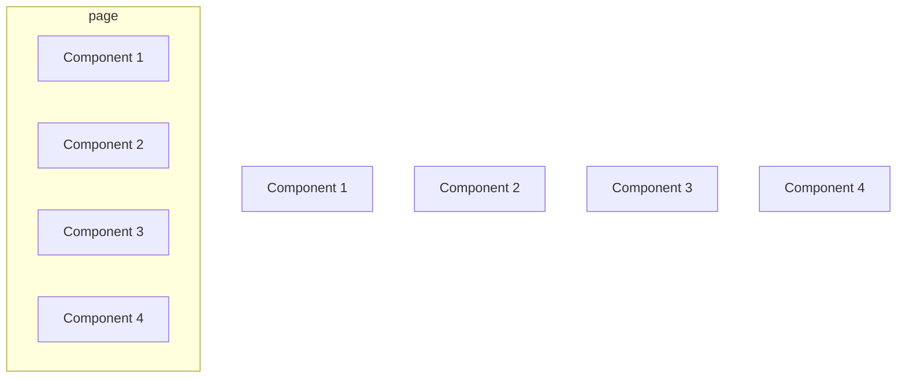

# Componentlerin Yapısı

React HTML içindeki element yapısını birer component olarak düşünerek componentleri bir sayfa içinde oluşturmayı sağlar. Şöyle düşünebiliriz

Sitemizdeki yazılar, görseller ve buna benzer birçok şey aslında birer component olarak geçmektedir.

